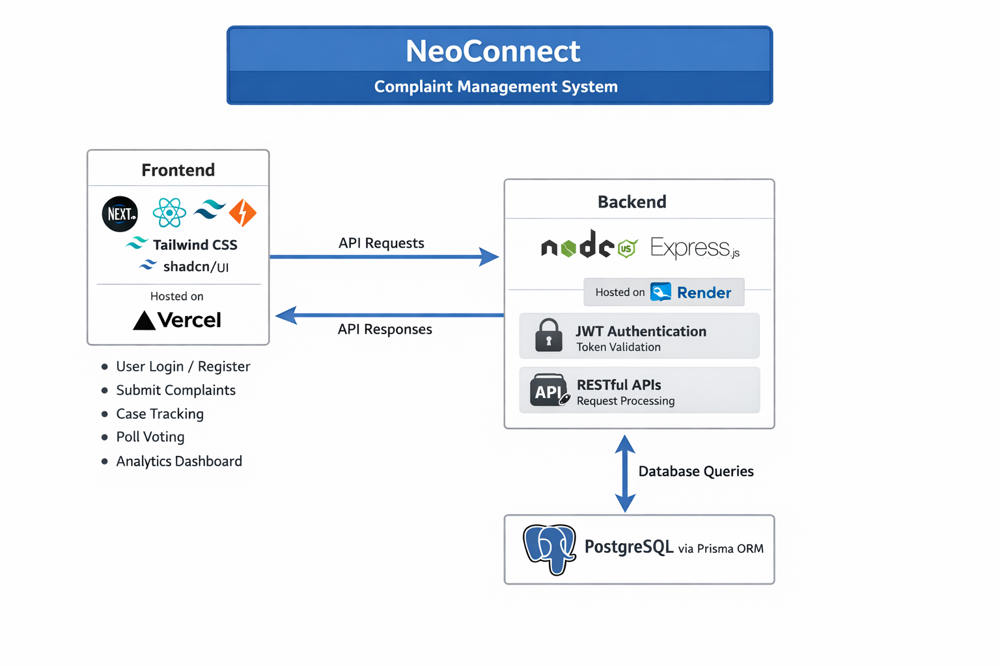

# NeoConnect Complaint Management System

<div align="center">
  <!-- Your custom image -->
  
  
 
  
  [](LICENSE)
  [](https://nodejs.org)
  [](https://expressjs.com)
  [](https://nextjs.org)
  [](https://reactjs.org)
  [](https://postgresql.org)
  [](https://tailwindcss.com)
  [](https://prisma.io)
</div>

---

## 📋 Tech Stack

| Frontend | Backend | Database |
|----------|---------|----------|
| ⚛️ Next.js | 🟢 Node.js | 🐘 PostgreSQL |
| ⚛️ React | 🚂 Express.js | |
| 🎨 Tailwind CSS | 🔷 Prisma (ORM) | |
| 🎯 shadcn/ui | | |

---

## ✨ Features

| | Feature | Description |
|--|---------|-------------|
| 🔐 | **User Authentication** | Secure login & registration with JWT |
| 📝 | **Complaint Submission** | File complaints with details and attachments |
| 📊 | **Case Tracking** | Monitor the status of submitted cases in real time |
| 🗳️ | **Poll Voting System** | Engage in community polls and see live results |
| 📈 | **Analytics Dashboard** | Visual insights into complaint trends and user engagement |
| 📱 | **Responsive Design** | Optimized for desktop, tablet, and mobile |

---

## 🚀 Deployment

| Platform | URL |
|----------|-----|
| 🌐 **Frontend (Vercel)** | [https://your-vercel-link.vercel.app](https://your-vercel-link.vercel.app) |
| ⚙️ **Backend (Render)** | [https://neoconnect-iggu.onrender.com] |

---

## 🛠️ Setup Instructions

### Backend

```bash
# Navigate to backend folder
cd backend

# Install dependencies
npm install

# Start the server
node server.js
```
### Frontend
```bash
# Navigate to frontend folder
cd frontend

# Install dependencies
npm install

# Run development server
npm run dev
```
